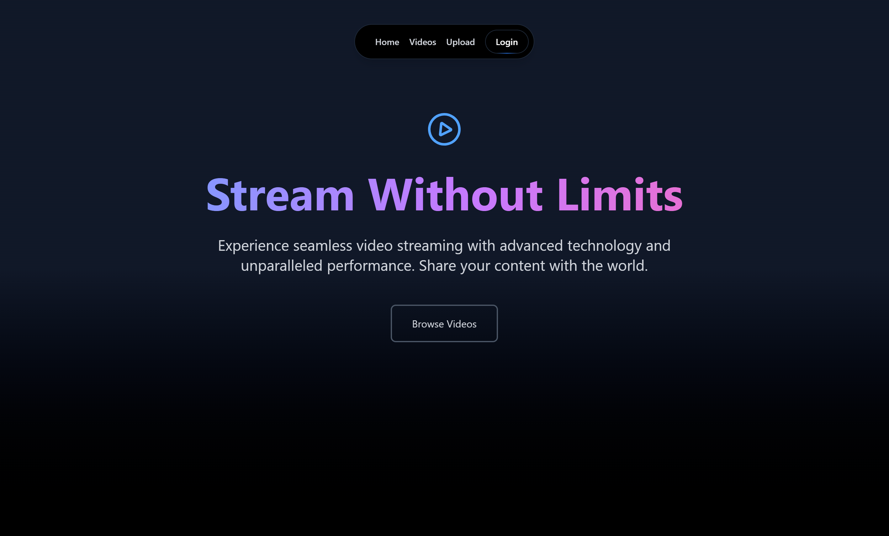

# Video Streaming Frontend

A React-based frontend application for streaming and managing videos, with a clean and intuitive user interface.
## Screenshots

### Landing Page


## 🎯 Features

- **User Authentication**
  - User registration
  - Login/logout functionality
  - Protected routes for authenticated users

- **Video Management**
  - Browse all available videos
  - Search videos by name
  - Upload new videos
  - Edit and delete your own videos
  - View video details

- **Video Streaming**
  - Smooth video playback
  - Video player controls
  - Responsive design for various screen sizes

## 🛠️ Tech Stack

- **Framework**: React with Vite
- **State Management**: React Context API
- **Routing**: React Router
- **HTTP Client**: Axios
- **Styling**: CSS/SCSS
- **Deployment**: Vercel

## 📁 Project Structure

```
frontend/
├── public/                # Static files
├── src/
│   ├── assets/            # Images, icons, etc.
│   ├── components/        # Reusable UI components
│   ├── context/           # React Context for state management
│   ├── pages/
│   │   ├── Home/          # Homepage
│   │   ├── VideoList/     # Video listing page
│   │   ├── VideoUpload/   # Video upload page
│   │   └── EditVideo/     # Video editing page
│   ├── auth/
│   │   ├── Login/         # Login page
│   │   └── Registration/  # Registration page
│   ├── routes/
│   │   ├── ProtectedRoute/# Authentication protection
│   │   └── Routes/        # Application routes
│   ├── server/            # API service functions
│   ├── utils/             # Utility functions
│   ├── App.jsx            # Main application component
│   └── main.jsx           # Application entry point
├── .env                   # Environment variables
├── package.json           # Project dependencies
└── vite.config.js         # Vite configuration
```

## 🚀 Installation and Setup

### Prerequisites
- Node.js 16+
- npm or yarn
- Git

### Local Setup

1. **Clone the repository**
   ```bash
   git clone https://github.com/shinas07/video-streaming-frontend.git
   cd video-streaming-frontend
   ```

2. **Install dependencies**
   ```bash
   npm install
   # or
   yarn install
   ```

3. **Configure environment variables**
   Create a `.env` file with the following:
   ```
   VITE_APP_API_URL=http://localhost:8000
   VITE_APP_TOKEN_SECRET=your_token_secret
   ```

4. **Start the development server**
   ```bash
   npm run dev
   # or
   yarn dev
   ```

5. **Build for production**
   ```bash
   npm run build
   # or
   yarn build
   ```

## 🌐 Pages and Functionality

- **Home Page**: Landing page with featured videos
- **Video List**: Browse and search all available videos
- **Video Upload**: Form for uploading new videos
- **Edit Video**: Interface for modifying existing videos
- **Login/Registration**: User authentication forms

## 🔄 Integration with Backend

The frontend communicates with the Django backend through RESTful API endpoints. Key integrations include:

- Authentication using JWT tokens
- Video CRUD operations
- Video streaming requests
- Search functionality

## 📱 Responsive Design

The application is designed to work seamlessly across:
- Desktop computers
- Tablets
- Mobile devices

## 🚢 Deployment

The application is deployed on Vercel and can be accessed at https://video-streaming-frontend-gamma.vercel.app/.

